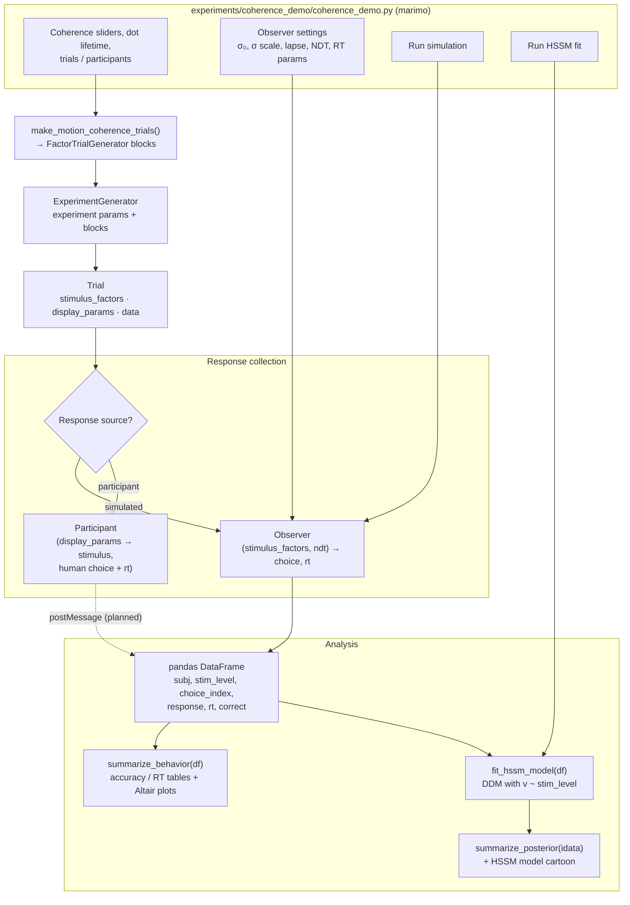
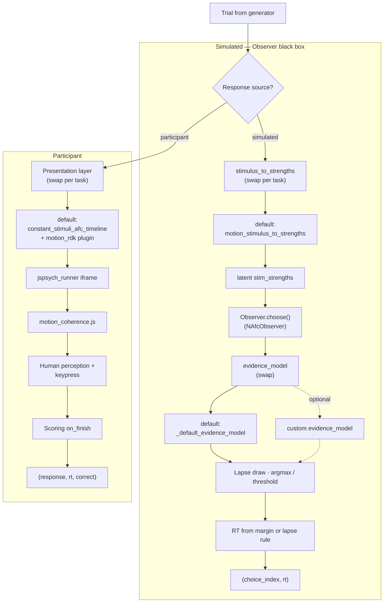

# Project Documentation

## Scope

This repository is organized as a modular experimentation and analysis workspace.  
It supports:

- browser-based task logic and previews
- interactive control and orchestration in `marimo`
- synthetic and participant-facing data collection flows
- downstream sequential-sampling analysis and visualization

The design favors interchangeable components so task logic, stimulus delivery, and observer/input sources can evolve without rewriting the full stack.

## Pipeline flowchart

End-to-end flow for the coherence marimo app (`experiments/coherence_demo/coherence_demo.py`). Trials are built once; **response collection** swaps a simulated **Observer** for a human participant; **analysis** (`analysis/hssm_pipeline.py`) summarizes the simulated DataFrame and optionally fits HSSM. Step-by-step detail is in [Runtime Flow](#runtime-flow).



After **Run simulation**, marimo builds `df` and renders `summarize_behavior` plots. **Run HSSM fit** is a separate control that calls `fit_hssm_model` then `summarize_posterior` (and the model cartoon).

The **Observer** node is a black box in this view. The diagram below is the same stage opened up: simulated path implements the box in Python (`observers/evidence_observer.py`); the participant path replaces it with browser presentation plus human input.

### Observer: simulated vs participant



**Simulated Observer — swappable hooks** (each arrow targets the **default** box used in this repo):

| Hook | Default (in diagram) | Typical swap |
|------|----------------------|--------------|
| `stimulus_to_strengths` | `motion_stimulus_to_strengths` | Another per-task mapper in `coherence_demo/coherence_demo.py` or at `NAfcObserver` construction |
| `evidence_model` | `_default_evidence_model` | Custom `Callable` on `NAfcObserver` |
| Observer class | `NAfcObserver` | Another class under `observers/` with the same `(factors, ndt) → (choice, rt)` surface |
| Presentation (participant) | `constant_stimuli_afc_timeline` + `motion_rdk` stimulus plugin | Other `AFCStimulusPlugin` + `renderers/` HTML |

**Tuned on `NAfcObserver` but fixed policy** (not plug-in hooks): `sigma0`, `sigma_scale`, `lapse_rate`, `evidence_weight`, `rt_scale`, `rt_noise`. Decision and RT rules inside `choose()` stay unless you replace the agent class.

**Participant path** — swap the presentation hook; the **default** motion stack is shown in the diagram. The human is the decision maker. Only `display_params` (and jsPsych metadata) affect what they see; `stimulus_factors` are mirrored in logging/scoring, not fed to `NAfcObserver`.

Internal decision/RT steps for the default simulated Observer are diagrammed in [`observers/observersDescriptions.md`](observers/observersDescriptions.md).

## Directory Map

Current structure:

- `experiments/`
  - `coherence_demo/` - marimo coherence → HSSM demonstration
    - `coherence_demo.py` - orchestration (demo runner, controls, simulation, plotting, model calls)
    - `coherence_timeline.py` - jsPsych demo timeline (intro, countdown, motion + feedback) and runner config
    - `motion_stimulus_plugin.py` - registers `motion_rdk` `AFCStimulusPlugin` for constant-stimuli presentation
    - `coherence_demo.css` - marimo UI styles for the demonstration
- `schemas/`
  - `contracts.py` - shared typed contracts (`ExperimentParams`, `Trial`, result message types)
  - `trial_generator.py` - abstract `TrialGenerator` and `FactorTrialGenerator`
  - `experimentGenerator.py` - `ExperimentGenerator`: experiment params + multiple `TrialGenerator` blocks
  - `timelines/`
    - `constant_stimuli_afc_timeline.py` - factorized n-AFC jsPsych timeline + stimulus plugin registry
- `renderers/`
  - `motion_coherence/` - RDK stimulus package
    - `motion_coherence_stimulus.py` - Python HTML helpers for jsPsych trials and marimo previews
    - `motion_coherence.js` - canvas animator + DOM helper (`MotionCoherence`, `__startAllMotionCanvases`)
    - `motion_coherence.css` - layout for stimulus wrapper and canvas
- `observers/`
  - `evidence_observer.py` - virtual observer behavior models
  - `observersDescriptions.md` - notes and flowcharts for each agent (`NAfcObserver` decision and RT rules)
- `runtime/`
  - `jspsych_runner.py` - `RunnerConfig` + HTML assembly (timeline/config base64 injection)
  - `jspsych_plugins.py` - jsPsych CDN plugin registry
  - `embed.py` - marimo `srcdoc` iframe helper
  - `jspsych_runner.html` - runner page skeleton
  - `jspsych_runner.css` - runner layout overrides (inlined)
  - `jspsych_runner_core.js` - generic timeline decode, plugin bind, jsPsych lifecycle
  - `jspsych_runner_boot.js` - reads injected config/timeline and starts core
  - `demo_results_charts.js` - in-iframe Vega-Lite accuracy/RT charts after demo completion
  - `demo_results_charts.js` - optional end-of-run charts in jsPsych iframe
- `analysis/`
  - `hssm_pipeline.py` - fit/summarize helpers for HSSM analyses
  - `descriptive_stats.py` - d-prime and standard error descriptive statistics helpers
- `README.md` - quickstart and run instructions
- `DOCUMENTATION.md` - this architecture guide
- `pyproject.toml` - project metadata and dependencies
- `uv.lock` - locked dependency graph for reproducible environments
- `.python-version` - local Python version hint

## Module Responsibilities

### `experiments/coherence_demo/coherence_demo.py`

Role:

- assembles the end-to-end interactive workflow in marimo
- includes an interactive participant-like demo block above simulation controls
- exposes UI controls for coherence levels, dot lifetime, trials/participants, and observer parameters
- uses separate run controls for simulation and HSSM fit
- renders task previews in the notebook UI
- runs data simulation loops using trial and observer modules
- executes HSSM model fitting and displays summaries/charts including an HSSM model cartoon plot

Motion display settings for this app only (not shared defaults elsewhere):

- fixed canvas sizes for previews and demo trials (`MOTION_CANVAS_*`, `MOTION_PREVIEW_*`)
- dot count, speed (px/s), and seed (`MOTION_N_DOTS`, `MOTION_SPEED_PX_S`, `MOTION_SEED`)
- dot lifetime from the **Dot lifetime (s)** number input (passed to previews and demo timeline)

Motion display settings and motion-specific trial sampling (`make_motion_coherence_trials`, `motion_stimulus_to_strengths`) live in `coherence_demo/coherence_demo.py` only.

Key integration boundaries:

- imports trial builders from `schemas/`
- imports observer behavior from `observers/`
- imports preview rendering helpers from `renderers/`
- imports model-fit utilities from `analysis/`
- keeps orchestration separate from implementation modules

Key helper structure:

- builds demo timeline via `experiments/coherence_demo/coherence_timeline.py`
- uses `runtime/embed.py` for iframe embedding and `RunnerConfig` for demo runner options

### `schemas/contracts.py`

Role:

- ``ExperimentParams``, ``Trial``, ``JsPsychTrial``, ``SimulatedObservation``, ``JsPsychResultsMessage``
- shared data shapes for trial generators, experiment organization, jsPsych adapters, and analysis ingest

### `schemas/trial_generator.py`

Role:

- abstract ``TrialGenerator``: stores an ordered list of trial parameter dicts, tracks an internal index, exposes ``next_trial()``, ``reset()``, and ``has_next()``
- ``FactorTrialGenerator``: concrete implementation for explicit / factorial trial lists; ``generate_trials()`` builds one trial dict

Trial generators do **not** own experiment-wide display defaults or output paths; they only build and iterate trials for one block (e.g. one coherence level).

### `schemas/experimentGenerator.py`

Role:

- ``ExperimentGenerator`` holds ``ExperimentParams`` (``display_params``, ``data_output_path``) and an ordered list of ``TrialGenerator`` instances
- ``add_trial_generator()`` attaches a block; ``next_trial()`` walks blocks in order, merging experiment ``display_params`` into each trial (trial keys win on conflict)
- ``all_trials()`` materializes the full experiment without advancing cursors

Simulation and the motion demo attach one ``FactorTrialGenerator`` per condition level (or per demo trial) via ``add_trial_generator()``.

### `schemas/timelines/constant_stimuli_afc_timeline.py`

Role:

- `AFCStimulusPlugin` — pluggable `render_stimulus(trial, index)` plus optional `on_load` / `on_finish`
- `constant_stimuli_afc_timeline(trials, stimulus_plugin=...)` — maps factorized n-AFC trials to jsPsych `html-keyboard-response` entries
- `build_afc_keyboard_trial` — single-trial builder; reads `choices`, `correct_key`, `presentation_duration_ms`, and `display_params` from the trial contract
- `register_stimulus_plugin` / `get_stimulus_plugin` — named plugins (e.g. motion RDK registered in `experiments/coherence_demo/motion_stimulus_plugin.py`)

### `experiments/coherence_demo/coherence_timeline.py`

Role:

- coherence-demo-only jsPsych timeline: intro → 3–2–1 countdown → motion trials (+ per-trial feedback)
- exports `coherence_runner_config()`, `build_coherence_demo_levels()`, `build_coherence_timeline()`
- demo coherence levels come from marimo sliders (A/B/C)
- `coherence_runner_config()` enables in-iframe result charts and loads `motion_coherence.js` + CSS

### `observers/evidence_observer.py`

Role:

- contains virtual observer classes for synthetic behavioral data
- models response policy, sensory uncertainty behavior, and lapse/random errors
- can be expanded to host multiple observer families (simple heuristics, SSM-consistent agents, etc.)

Current `NAfcObserver` behavior:

- Accepts experiment ``stimulus_factors``; derives latent ``stim_strengths`` via ``stimulus_to_strengths``.
- ``evidence_weight`` is an observer parameter (default all ones = no directional bias).
- Latent evidence defaults to `evidence_weight * stim_strengths + Gaussian noise`.
- Sensory noise uses `sigma = sigma0 + sigma_scale * c` where `c` is driven by task difficulty (`1 - coherence`, `coherence = max(stim_strengths)`).
- Lapse path is explicit: with probability `lapse_rate`, choice is random and RT is generated from lapse RT logic.
- Non-lapse choice for n-AFC uses `argmax(evidence)`; 1-stimulus mode uses sign-threshold detection.
- Non-lapse RT uses evidence margin (`abs(chosen - max(other))` for n-AFC) with `rt = ndt + rt_scale / margin_abs + noise`.
- Optional `evidence_model` can override latent evidence generation while preserving shared evidence for choice and non-lapse RT.

Why it exists:

- clean separation between *task definition* and *response-generation policy*
- enables swapping human-input channels vs simulated agents with minimal orchestration changes

### `renderers/motion_coherence/`

Role:

- `motion_coherence_stimulus.py` — marimo preview iframes and jsPsych trial canvas markup
- `motion_coherence.js` — RDK animator and `MotionCoherence.createMotionCoherenceCanvas` DOM helper
- `motion_coherence.css` — stimulus wrapper and canvas layout (via `RunnerConfig.extra_styles`)

Motion stimulus contract (canvas `data-*` attributes read by `motion_coherence.js`):

- `data-stim-level`, `data-dir-sign`, `data-seed`, `data-n-dots`
- `data-speed-px-s` — motion speed in pixels per second (time-based `requestAnimationFrame` updates)
- `data-dot-lifetime-s` — dot survival time in seconds; expired or out-of-bounds dots respawn at a new random location

Canvas elements use explicit pixel width/height (no responsive scaling) so speed is consistent across browsers.

Why it exists:

- visual preview logic should not live inside trial-generation or observer classes
- allows changing rendering implementation (Canvas, jsPsych plugin views, media assets) without changing trial or analysis code

### `runtime/jspsych_runner.py`

Role:

- creates a standalone jsPsych runtime HTML document for iframe `srcdoc`
- `RunnerConfig` selects plugins, optional `extra_scripts`, input policies, and optional end-of-run charts
- injects timeline + config as base64 JSON for the boot script
- loads CDN plugin scripts from `jspsych_plugins.py`

### `runtime/embed.py`

Role:

- wraps runner HTML in a marimo-safe `<iframe srcdoc="...">` helper

### jsPsych v7 runtime contract

The runner targets **jsPsych 7** (CDN). There is **no global `jsPsych`** object.

- `jspsych_runner_core.js` calls `initJsPsych(...)` and assigns `window.__jsPsychInstance`.
- Eval'd trial callbacks (Python string `on_finish` / `stimulus` functions) must use `window.__jsPsychInstance` for `data`, `pluginAPI`, etc.
- Do not reference bare `jsPsych` in timeline strings (throws `MigrationError`).

Example (motion scoring):

```javascript
function(data) {
  const j = window.__jsPsychInstance;
  data.correct = j.pluginAPI.compareKeys(data.response, data.correct_key);
}
```

Extension pattern for new tasks:

1. Add renderer HTML contract (if needed) under `renderers/`
2. Add browser stimulus assets under `renderers/<paradigm>/` (JS/CSS) and reference via `RunnerConfig.extra_scripts` / `extra_styles`
3. Register an `AFCStimulusPlugin` and pass it to `constant_stimuli_afc_timeline` (or reuse `map_trials_to_jspsych_timeline` with a custom builder)
4. Pass `RunnerConfig(plugins=(...), extra_scripts=(...), input_arrow_keys=...)` when building HTML
5. Use `window.__jsPsychInstance` in any eval'd jsPsych trial callbacks

### `analysis/descriptive_stats.py`

Role:

- provides descriptive statistics helpers independent of fitting pipeline
- includes `dprime(...)` with mode-based inputs (`rates` or `counts`)
- includes `standard_error(...)` with mode-based inputs (`values` or `percentages`)
- keeps descriptive statistics separate from HSSM model-fitting code

## Runtime Flow

### Browser demo (participant-like)

1. marimo builds a timeline via `build_coherence_timeline()` (`ExperimentGenerator` + per-level `FactorTrialGenerator` blocks) using slider levels A/B/C and user dot lifetime.
2. `build_jspsych_runner_html(timeline, config=coherence_runner_config())` inlines HTML/CSS/JS assets.
3. `render_srcdoc_iframe()` embeds the runner; user clicks **Restart demo** to rebuild with fresh random directions.
4. Boot script decodes timeline + config; `JsPsychRunnerCore` binds plugins and runs jsPsych.
5. After intro, a 3-second countdown runs; then motion trials call `__startAllMotionCanvases` on `on_load`.
6. Scoring uses `__jsPsychInstance` on `on_finish`; feedback trials follow each motion trial.
7. On experiment end, in-iframe Vega-Lite charts summarize accuracy and mean RT by coherence (`demo_results_charts.js`).
8. Runner also posts `{ type: "jspsych-results", rows }` to parent (marimo ingest path not yet wired).

### Python simulation + HSSM

1. marimo UI collects task and observer parameters.
2. Per condition level, `make_motion_coherence_trials()` returns a `FactorTrialGenerator` block; blocks are attached to an `ExperimentGenerator`, which serves trials with merged experiment `display_params` / `data_output_path` when set.
3. `NAfcObserver.choose(stimulus_factors)` builds latent evidence, choice, and RT (explicit lapse path).
4. tabular data is assembled for modeling.
5. user triggers HSSM fit with dedicated run control.
6. summaries and charts are rendered in-app (including model cartoon).

## Extension Guidelines

Use these boundaries when adding new functionality:

- **New task types**: add simulator classes/functions under `schemas/`
- **New stimuli modalities**: add preview/render helpers under `renderers/`
- **New observer/input sources**: add classes under `observers/` and keep choice/RT coupled to the same latent signal model when possible
- **New analysis models**: add model-specific fit/plot helpers under `analysis/`

Prefer data contracts (plain dict/dataframe schemas) between modules over direct cross-calls to keep components interchangeable.

## Data Contracts (Current)

Experiment-level (`ExperimentParams`):

- `display_params` — defaults merged into each trial's `display_params` by `ExperimentGenerator`
- `data_output_path` — optional; copied into each trial's `data` as `data_output_path` when set

Trial-level fields currently used by the pipeline:

- `task`
- `stimulus_factors` (experiment factors controlling the stimulus)
- `display_params` (presentation/display parameters)
- `presentation_duration_ms` (`None` = unlimited until response)
- `correct_index`
- jsPsych metadata fields (`choices`, `correct_key`, nested `data`, etc.)

Modeled dataset fields:

- `subj`
- `stim_level`
- `choice_index`
- `response`
- `rt`
- `correct`

Any new task module should document equivalent fields and provide a normalization step if names differ.

## Packaging Notes

The project follows a split-by-concern layout (`schemas/`, `renderers/`, `observers/`, `analysis/`) with `experiments/` housing marimo entrypoints.
