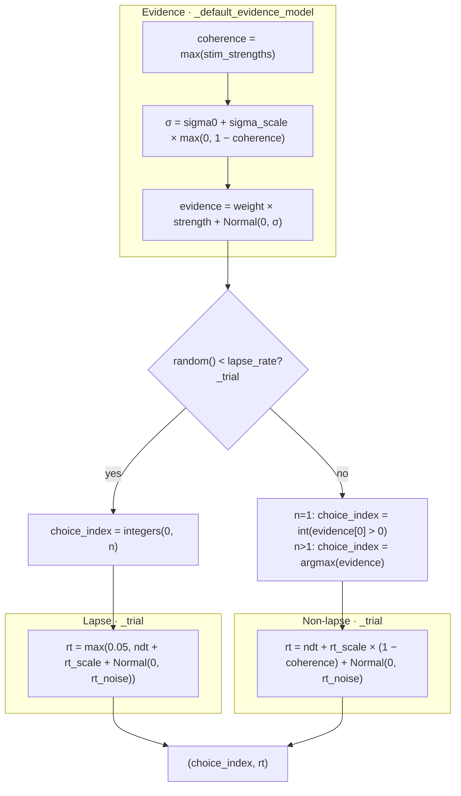
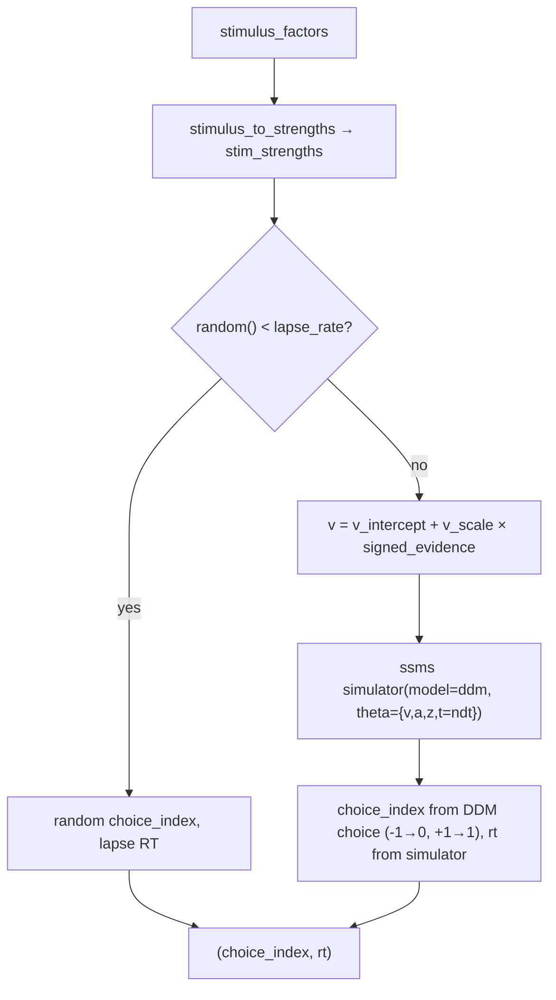

# Agent descriptions

Plain-language notes for virtual observers under `observers/`. Each section includes a flowchart aligned with the implementation.

---

## `NAfcObserver` (`heuristic_observer.py`)

Virtual n-AFC observer: one trial in, `(choice_index, rt)` out. Choice uses noisy latent evidence; non-lapse RT scales with coherence.

### Overview

- **Inputs per trial:** `stimulus_factors`, `ndt`
- **`stimulus_to_strengths`** maps experiment params to latent `stim_strengths` inside the observer
- **`evidence_weight`** (observer parameter; all ones = no bias) multiplies latent strengths before noise
- **Output:** `(choice_index, rt)`
- Optional **`evidence_model`** hook replaces default latent evidence generation

### Flowchart

Default path (`evidence_model` is `None`). Matches `choose()` → `_trial()` in `heuristic_observer.py`.



### Sensory noise

- `sigma = sigma0 + sigma_scale * c` where `c = max(0, stim_level)`
- In the default evidence model, difficulty uses `c = 1 - coherence` with `coherence = max(stim_strengths)`
- Lower coherence → larger sensory noise

### Evidence (latent signal)

- Default per alternative `i`:
  - `evidence[i] = evidence_weight[i] * stim_strengths[i] + Normal(0, sigma)`
- Custom: `evidence_model(observer, weight_arr, strength_arr)`

### Decision rule

1. Lapse check: if `random() < lapse_rate` → random `choice_index`
2. Else if **1-stimulus:** present/absent from `evidence[0] > 0`
3. Else **n-AFC:** `choice_index = argmax(evidence)`

### Reaction time (non-lapse)

- `coherence = max(stim_strengths)` (motion demo: proportion coherent)
- `rt = ndt + rt_scale × (1 − coherence) + Normal(0, rt_noise)` — lower coherence → longer RT

### Reaction time (lapse)

- Independent of evidence: `rt = max(0.05, ndt + rt_scale + Normal(0, rt_noise))`

### Notes

- Non-lapse RT depends on coherence only, not post-choice evidence
- Lapse RT has a lower floor of 0.05 s

---

## `DdmObserver` (`ssm_ddm_observer.py`)

Forward DDM observer using **ssm-simulators**: strengths → signed drift → one simulator draw → `(choice_index, rt)`.

### Overview

- **Same surface as** `NAfcObserver`: `choose(stimulus_factors, ndt)` and optional `stimulus_to_strengths`
- **SSM parameters:** `v_intercept`, `v_scale`, `a`, `z` (plus `lapse_rate`, `lapse_rt_extra`)
- **`ndt` from the experiment** is passed through as DDM non-decision time `t`
- **Output:** `(choice_index, rt)` with `choice_index` 0 = lower boundary (left), 1 = upper (right)

### Drift mapping

```text
signed_evidence = strength[1] - strength[0]   # n > 1
v_trial = v_intercept + v_scale × signed_evidence
```

For motion coherence with `motion_stimulus_to_strengths`, positive signed evidence favors the right alternative (upper boundary).

### Flowchart



### Usage

```python
from observers.ssm_ddm_observer import DdmObserver

observer = DdmObserver(
    v_scale=2.5,
    a=1.2,
    z=0.5,
    stimulus_to_strengths=motion_stimulus_to_strengths,
    rng=rng,
)
choice_index, rt = observer.choose(stimulus_factors, ndt=0.3)
```
